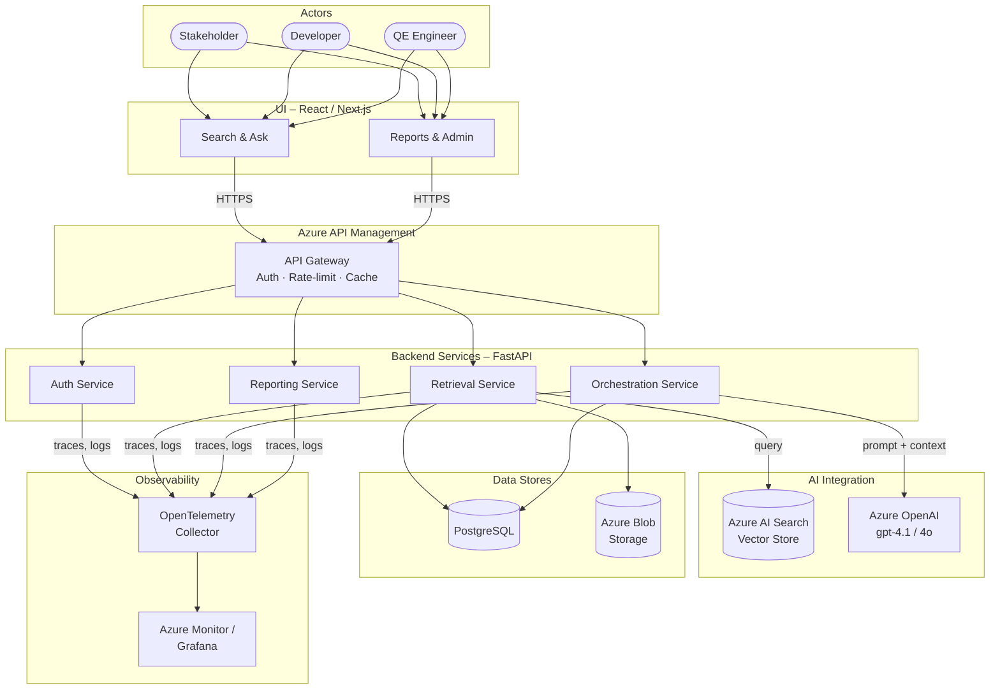

[← Back to Architecture Hub](../index.md)
{: .fs-3 }

# 2. Architecture at a Glance

> Context diagram showing how actors interact with the platform through the UI, API gateway, backend services, AI layer, data stores, and observability stack.

---

## Context Diagram

---

## Layer Summary

| Layer | Technology | Role |
|---|---|---|
| **UI** | React 19 / Next.js 15 | Conversational search, reports, admin |
| **Gateway** | Azure API Management | Auth, rate-limiting, caching |
| **Backend** | Python FastAPI | Auth, retrieval, orchestration, reporting |
| **AI** | Azure OpenAI + Azure AI Search | LLM completion, vector/hybrid search |
| **Data** | PostgreSQL + Blob Storage | Relational data, raw document storage |
| **Observability** | OpenTelemetry + Azure Monitor | Distributed tracing, metrics, logs |

---

**Previous:** [← Overview](01-overview.md) · **Next:** [AI Integration →](03-ai-integration.md)
