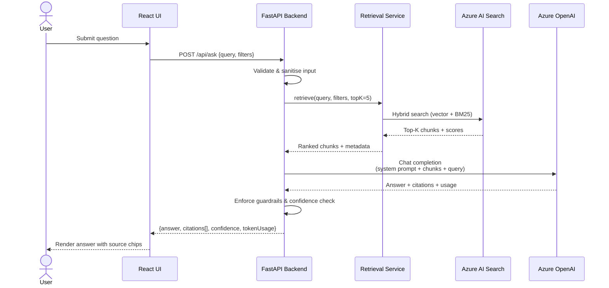

[← Back to Architecture Hub]({{ '/' | relative_url }})
{: .fs-3 }

# 3. AI Integration (LLM + RAG)

---

## LLM Providers

| Capability | Service | Model |
|---|---|---|
| Chat / completion | Azure OpenAI | `gpt-4.1` (primary), `gpt-4o` (fallback) |
| Embeddings | Azure OpenAI | `text-embedding-3-large` (3 072 dims) |

---

## Vector Store

**Azure AI Search** (S1 tier)

- HNSW index with cosine similarity.
- Hybrid retrieval: BM25 lexical **+** vector, fused via Reciprocal Rank Fusion (RRF).
- Filterable fields: `source`, `docType`, `dateIngested`, `confidentiality`.

---

## Chunking Strategy & Metadata Schema

| Parameter | Value |
|---|---|
| Chunk size | 512 tokens |
| Overlap | 64 tokens |
| Splitter | Recursive character (sentence-aware) |
| Metadata per chunk | `docId`, `chunkIndex`, `title`, `source`, `pageNumber`, `dateIngested` |

```python
# Example: chunk metadata schema
{
    "id": "a3f1-...",
    "docId": "doc-9182",
    "chunkIndex": 4,
    "title": "Compliance Handbook v3",
    "source": "sharepoint://teams/qi/docs/handbook.pdf",
    "pageNumber": 12,
    "dateIngested": "2026-02-18T10:00:00Z",
    "embedding": [0.012, -0.034, ...]  # 3072-d vector
}
```

---

## Retrieval Pipeline

1. **Query embedding** – embed user query via `text-embedding-3-large`.
2. **Hybrid search** – issue parallel vector + BM25 queries against Azure AI Search.
3. **Metadata filters** – apply pre-filters (`docType`, `confidentiality` ≤ user clearance).
4. **Top-K fusion** – RRF merge, return top **K = 5** chunks.
5. **Re-ranking** (optional) – cross-encoder re-ranker for precision-critical paths.

---

## Prompt Orchestration & Guardrails

- **System prompt template** enforces role, citation format, and refusal behaviour.
- **Content filters** – Azure OpenAI content safety (hate, self-harm, sexual, violence).
- **Token budget** – reserve 1 024 tokens for answer; fill remaining context window with chunks.
- **Prompt injection defence** – input sanitisation + delimiting of user input with XML tags in prompt.

---

## Caching Strategy

| Cache Layer | Scope | TTL |
|---|---|---|
| Semantic cache (embedding similarity ≥ 0.97) | Retrieval results | 1 h |
| Response cache (exact query hash) | Full LLM response | 15 min |
| Embedding cache | Per-document chunk | Until re-index |

---

## Hallucination Controls

- Every claim must map to a `[source N]` citation; uncitable claims trigger a fallback disclaimer.
- Confidence score (0–1) derived from retrieval similarity + LLM logprobs.
- Threshold: responses with confidence < **0.6** display a low-confidence banner.
- Golden-set regression: weekly automated eval against 200 curated Q&A pairs.

---

## RAG Sequence Diagram



---

**Previous:** [← Architecture at a Glance]({{ '/docs/architecture-at-a-glance/' | relative_url }}) · **Next:** [UI/UX →]({{ '/docs/ui-ux/' | relative_url }})
