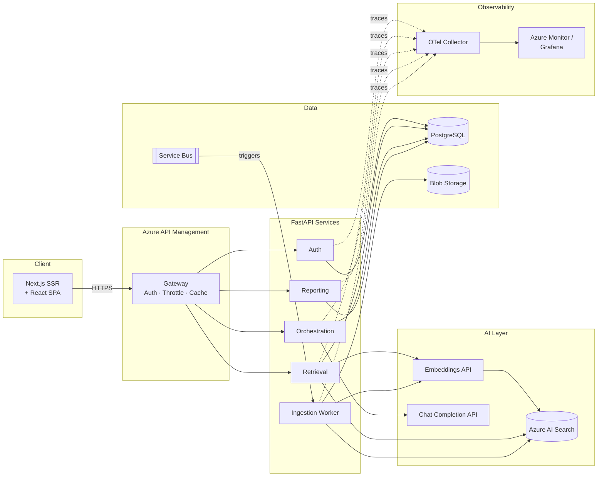

[← Back to Architecture Hub](../index.md)
{: .fs-3 }

# 5. Backend & APIs

---

## API Gateway – Azure API Management

- JWT validation (Entra ID tokens).
- Rate limiting: 60 req/min per user, 600 req/min per tenant.
- Response caching (15 min, query-hash key).
- Request/response logging to Azure Monitor.

---

## Service Decomposition

| Service | Responsibility | Tech |
|---|---|---|
| **Auth Service** | Token validation, RBAC, session management | FastAPI + python-jose |
| **Retrieval Service** | Embedding, hybrid search, re-ranking | FastAPI + azure-search-documents |
| **Orchestration Service** | Prompt assembly, LLM call, guardrails | FastAPI + openai SDK |
| **Reporting Service** | Metrics aggregation, export, dashboards | FastAPI + SQLAlchemy |
| **Ingestion Worker** | Document parsing, chunking, indexing | Celery worker (async) |

### Example Route

```python
# FastAPI route example – /api/ask
from fastapi import APIRouter, Depends
from app.auth import require_user
from app.services.retrieval import retrieve_chunks
from app.services.orchestration import generate_answer
from app.schemas import AskRequest, AskResponse

router = APIRouter(prefix="/api")

@router.post("/ask", response_model=AskResponse)
async def ask(req: AskRequest, user=Depends(require_user)):
    chunks = await retrieve_chunks(req.query, req.filters, top_k=5)
    answer = await generate_answer(req.query, chunks, user=user)
    return AskResponse(
        answer=answer.text,
        citations=answer.citations,
        confidence=answer.confidence,
        token_usage=answer.usage,
    )
```

---

## Async Processing

- **Azure Service Bus** (Standard tier) for ingestion jobs and long-running tasks.
- Topics: `document-ingested`, `index-updated`, `report-generated`.
- Dead-letter queue with alert on DLQ depth > 10.

---

## Component Diagram



---

**Previous:** [← UI/UX](04-ui-ux.md) · **Next:** [Data & Storage →](06-data-storage.md)
