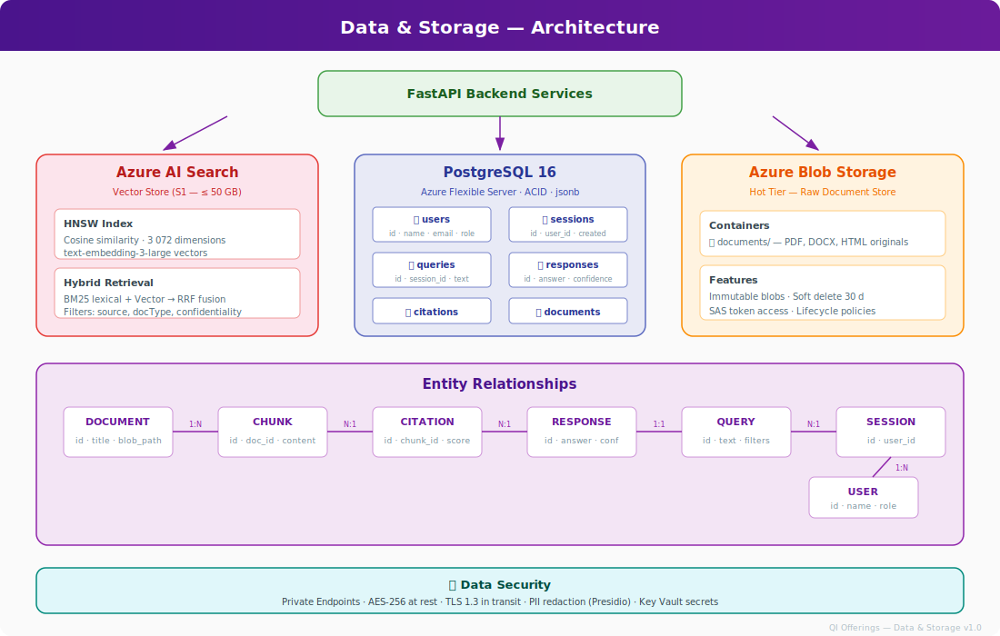
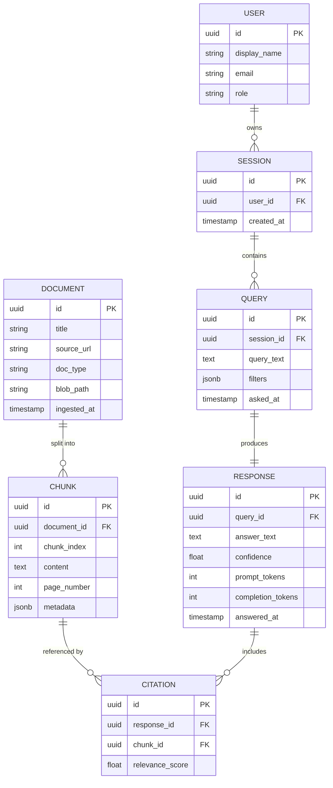

[← Back to Architecture Hub](../index.md)
{: .fs-3 }

# 6. Data & Storage

---

## Architecture Diagram

---

## Storage Map

| Store | Technology | Purpose |
|---|---|---|
| Vector index | Azure AI Search (S1) | Chunk embeddings + metadata, hybrid retrieval |
| Primary DB | PostgreSQL 16 (Azure Flexible Server) | Users, sessions, queries, responses, audit |
| Object store | Azure Blob Storage (Hot tier) | Raw documents (PDF, DOCX, HTML) |

---

## Entity-Relationship Diagram

---

## Key Design Decisions

- **PostgreSQL** chosen for ACID compliance, JSON support (`jsonb`), and mature Azure managed service.
- **Azure AI Search** provides built-in hybrid (vector + BM25) retrieval without managing a separate vector DB.
- **Blob Storage** (Hot tier) for fast retrieval of source documents during citation lookup.
- All stores connected via **Private Endpoints** (no public access).

---

**Previous:** [← Backend & APIs](05-backend-apis.md) · **Next:** [Security & Compliance →](07-security-compliance.md)
