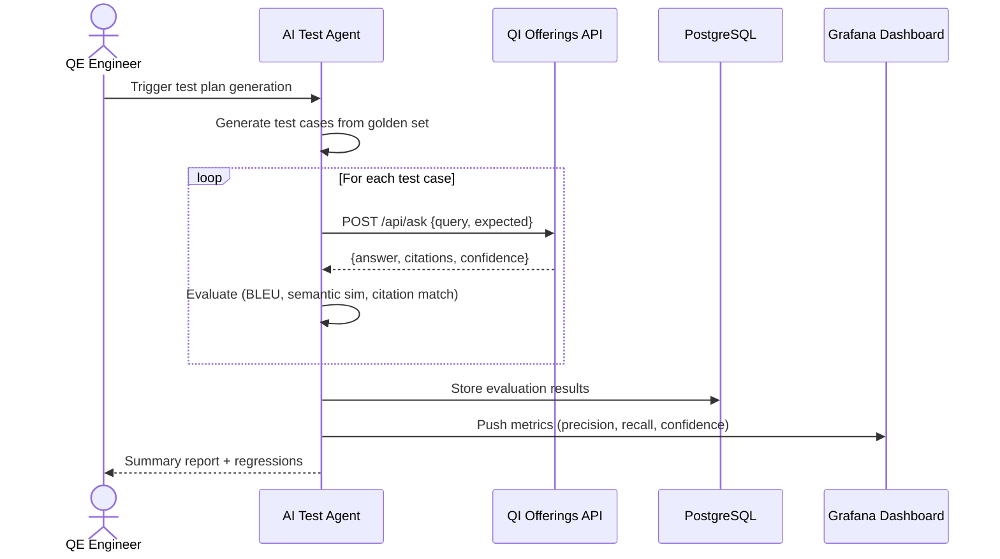

[← Back to Architecture Hub]({{ '/' | relative_url }})
{: .fs-3 }

# 8. Observability & Quality Engineering (QE)

---

## Logging & Tracing

- **OpenTelemetry SDK** instrumented in every FastAPI service.
- Traces exported to **Azure Monitor Application Insights** (W3C trace-context).
- Structured JSON logs → Azure Log Analytics workspace.
- Correlation ID propagated from UI → Gateway → all services.

---

## Key Metrics

| Metric | Source | Target |
|---|---|---|
| E2E latency (p50 / p95) | App Insights | ≤ 1.5 s / ≤ 3 s |
| Token usage (prompt + completion) | OpenAI SDK callback | Budget ≤ 500 K tokens/day |
| Retrieval precision@5 | Offline eval job | ≥ 0.85 |
| Answer confidence (mean) | Orchestration Service | ≥ 0.75 |
| Error rate (5xx) | APIM analytics | < 0.5 % |
| Ingestion throughput | Service Bus metrics | ≥ 100 docs/hr |

---

## Quality Engineering

- **Synthetic E2E tests** – Playwright test suite against staging (runs nightly).
- **AI test-data agent** – generates realistic question variants from golden set using GPT-4.1.
- **Performance tests** – k6 load tests simulating 200 concurrent users; run pre-deploy.
- **Retrieval regression** – weekly comparison of precision/recall against baseline.

---

## Test Automation Agent Sequence

---

**Previous:** [← Security & Compliance]({{ '/docs/security-compliance/' | relative_url }}) · **Next:** [Deployment & Environments →]({{ '/docs/deployment/' | relative_url }})
