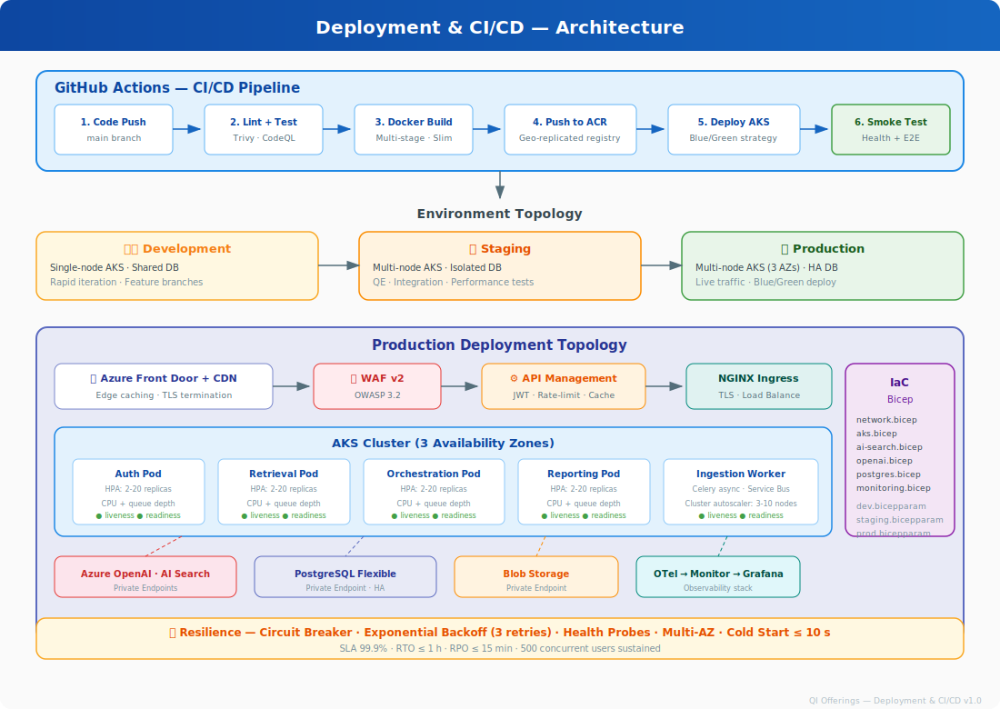
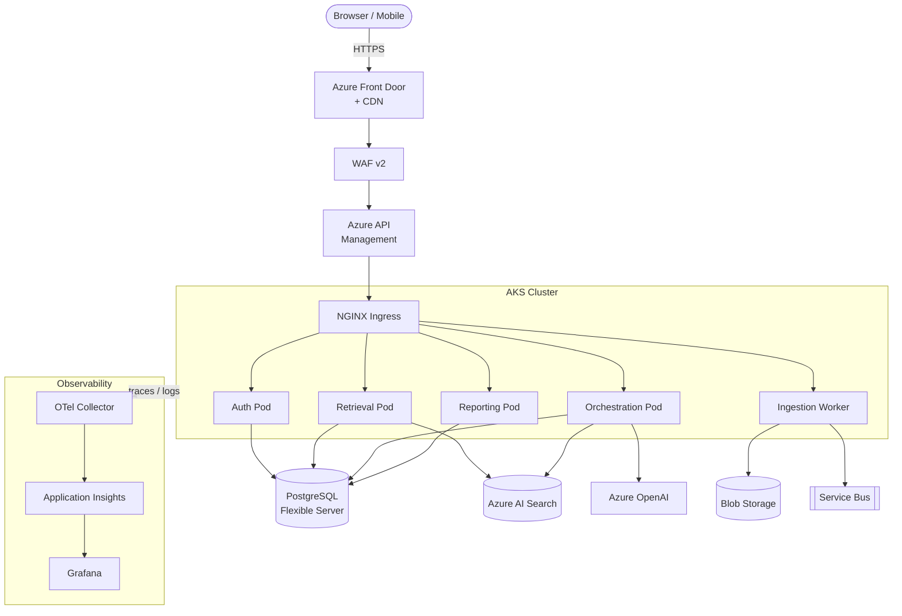

[← Back to Architecture Hub](../index.md)
{: .fs-3 }

# 9. Deployment & Environments

---

## Architecture Diagram



---

## Environment Topology

| Environment | Purpose | Infra |
|---|---|---|
| `dev` | Feature development, rapid iteration | Single-node AKS, shared DB |
| `staging` | Integration, QE, performance testing | Multi-node AKS, isolated DB |
| `production` | Live traffic | Multi-node AKS (3 zones), HA DB |

---

## Packaging

- All services containerised with **multi-stage Dockerfiles** (slim Python 3.12 base).
- Images pushed to **Azure Container Registry** (geo-replicated).

---

## Orchestration

- **Azure Kubernetes Service (AKS)** with managed node pools.
- Horizontal Pod Autoscaler (HPA) on CPU + custom metric (request queue depth).
- Ingress via **NGINX Ingress Controller** (TLS termination).

---

## CI/CD – GitHub Actions

```yaml
# .github/workflows/deploy.yml (simplified)
name: Build & Deploy
on:
  push:
    branches: [main]

jobs:
  build:
    runs-on: ubuntu-latest
    steps:
      - uses: actions/checkout@v4
      - uses: docker/build-push-action@v6
        with:
          push: true
          tags: ${{ env.ACR_LOGIN_SERVER }}/qi-api:${{ github.sha }}

  deploy:
    needs: build
    runs-on: ubuntu-latest
    steps:
      - uses: azure/k8s-deploy@v5
        with:
          manifests: k8s/
          images: ${{ env.ACR_LOGIN_SERVER }}/qi-api:${{ github.sha }}
          strategy: blue-green
```

---

## Infrastructure as Code

- **Bicep** templates in `/infra` for all Azure resources.
- Modules: `network.bicep`, `aks.bicep`, `ai-search.bicep`, `openai.bicep`, `postgres.bicep`, `monitoring.bicep`.
- `bicep param` files per environment (`dev.bicepparam`, `staging.bicepparam`, `prod.bicepparam`).

---

## Deployment Diagram



---

**Previous:** [← Observability & QE](08-observability-qe.md) · **Next:** [Non-Functional Requirements →](10-nfr.md)
