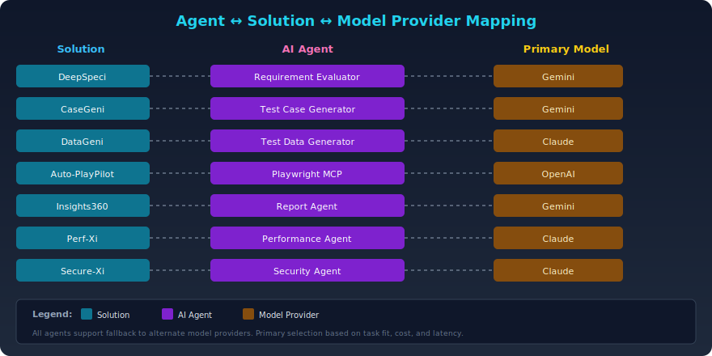
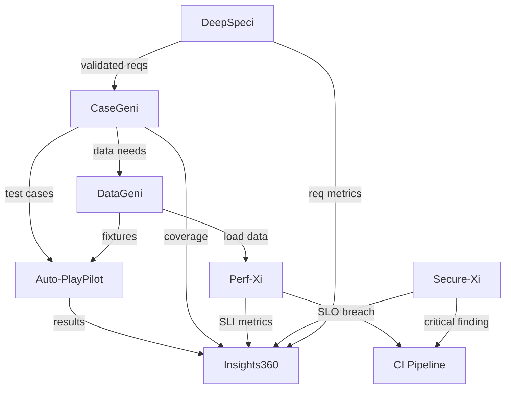

[← Back to Architecture Hub](../index.md)
{: .fs-3 }

<!-- Platform Architecture Diagram -->

<!-- Agent Mapping Diagram -->

# ZenseAI.Qi – Platform Architecture

---

## End-to-End Architecture Diagram

```mermaid
flowchart TB
    subgraph Stakeholders["Stakeholders / Business Users"]
        MGR([Manager])
        DEV([Developer])
        NTU([Non-Technical User])
        SME([SME])
    end

    subgraph SkilledUsers["Skilled QI Users"]
        TM([Technical Manager])
        AE([Automation Engineer])
        SE([Security Engineer])
        PE([Performance Engineer])
    end

    subgraph QIWorkspace["QI Workspace"]
        DS[DeepSpeci]
        CG[CaseGeni]
        DG[DataGeni]
        APP[Auto-PlayPilot]
        I360[Insights360]
        PX[Perf-Xi]
        SX[Secure-Xi]
    end

    subgraph AIAgents["AI Agents"]
        RE[Requirement Evaluator]
        TCG[Test Case Generator]
        TDG[Test Data Generator]
        PMCP[Playwright MCP]
        RA[Report Agent]
        PA[Performance Agent]
        SA[Security Agent]
    end

    subgraph Providers["Model Providers"]
        GEM[Gemini]
        CLA[Claude]
        OAI[OpenAI]
    end

    %% Stakeholders → QI Workspace
    MGR & DEV & NTU & SME --> DS
    MGR & DEV & NTU & SME --> I360

    %% Skilled Users → QI Workspace
    TM --> DS & CG
    AE --> CG & DG & APP
    SE --> SX
    PE --> PX

    %% QI Workspace → AI Agents (AI Integration)
    DS -->|requirements| RE
    CG -->|scenarios| TCG
    DG -->|data needs| TDG
    APP -->|automation| PMCP
    I360 -->|reporting| RA
    PX -->|load tests| PA
    SX -->|scanning| SA

    %% Model Providers → AI Agents
    GEM --> RE & TCG & TDG
    CLA --> RE & TCG & RA
    OAI --> RE & TCG & TDG & PMCP & RA & PA & SA

    %% Cross-links (agents feed back to workspace)
    RE -.->|validated reqs| DS
    TCG -.->|test cases| CG
    TDG -.->|test data| DG
    PMCP -.->|scripts| APP
    RA -.->|reports| I360
    PA -.->|metrics| PX
    SA -.->|findings| SX
```

---

## Architecture Walkthrough

### User Flows

- **Business stakeholders** (Managers, Developers, Non-Technical Users, SMEs) interact primarily with **DeepSpeci** for requirement analysis and **Insights360** for consolidated reporting and dashboards.
- **Skilled QI Users** (Technical Manager, Automation Engineer, Security Engineer, Performance Engineer) access specialised solutions mapped to their QE discipline.

### QI Workspace → AI Agent Integration

| QI Workspace Solution | Primary AI Agent(s) | Flow |
|---|---|---|
| **DeepSpeci** | Requirement Evaluator | Interprets & validates business requirements; detects gaps and ambiguities |
| **CaseGeni** | Test Case Generator | Generates structured test scenarios from validated requirements |
| **DataGeni** | Test Data Generator | Produces synthetic and conditional test data aligned to scenarios |
| **Auto-PlayPilot** | Playwright MCP | Converts test cases into executable Playwright automation scripts |
| **Insights360** | Report Agent | Aggregates results into executive reports, dashboards, and analytics |
| **Perf-Xi** | Performance Agent | Coordinates performance test execution and observability metrics |
| **Secure-Xi** | Security Agent | AI-powered vulnerability scanning and threat anomaly detection |

### Model Provider Routing

| Provider | Strengths | Primary Agent Consumers |
|---|---|---|
| **Gemini** | Large-context reasoning, multi-modal | Requirement Evaluator, Test Case Generator, Test Data Generator |
| **Claude** | Nuanced analysis, long-form output | Requirement Evaluator, Test Case Generator, Report Agent |
| **OpenAI** | Broad capability, tool-use, code gen | All agents (primary fallback) |

- Model selection is **configurable per agent** based on task complexity, latency requirements, and cost.
- A **model router** layer can switch providers at runtime using quality scores and cost budgets.

### QE Work Lanes Mapping

| QE Work Lane | Solutions | Agents |
|---|---|---|
| Requirements interpretation & validation | DeepSpeci | Requirement Evaluator |
| Testing approaches & structured scenarios | CaseGeni, DeepSpeci | Test Case Generator, Requirement Evaluator |
| Data conditions & dependencies | DataGeni | Test Data Generator |
| Test library creation & AI-assisted automation | Auto-PlayPilot, CaseGeni | Playwright MCP, Test Case Generator |
| Performance test coordination & observability | Perf-Xi, Insights360 | Performance Agent, Report Agent |
| Vulnerability scanning & threat analysis | Secure-Xi | Security Agent |

### Feedback Loops (Dotted Lines)

Every AI Agent produces artifacts that feed **back** into the originating QI Workspace solution:
- **Requirement Evaluator** → validated requirements back to DeepSpeci
- **Test Case Generator** → structured test cases back to CaseGeni
- **Test Data Generator** → synthetic datasets back to DataGeni
- **Playwright MCP** → executable scripts back to Auto-PlayPilot
- **Report Agent** → analytics reports back to Insights360
- **Performance Agent** → performance metrics back to Perf-Xi
- **Security Agent** → vulnerability findings back to Secure-Xi

---

**Next:** [Roles & Personas →](roles.md)

---

## Solution Architectures

Each of the 7 QI Workspace solutions has its own dedicated architecture and implementation document with full details including component design, API contracts, data model, deployment configuration, and implementation roadmap.

| # | Solution | Agent | Architecture & Implementation |
|---|---|---|---|
| 1 | DeepSpeci | Requirement Evaluator | [📐 Architecture →](architecture/deepspeci.md) |
| 2 | CaseGeni | Test Case Generator | [📐 Architecture →](architecture/casegeni.md) |
| 3 | DataGeni | Test Data Generator | [📐 Architecture →](architecture/datageni.md) |
| 4 | Auto-PlayPilot | Playwright MCP | [📐 Architecture →](architecture/auto-playpilot.md) |
| 5 | Insights360 | Report Agent | [📐 Architecture →](architecture/insights360.md) |
| 6 | Perf-Xi | Performance Agent | [📐 Architecture →](architecture/perf-xi.md) |
| 7 | Secure-Xi | Security Agent | [📐 Architecture →](architecture/secure-xi.md) |

Each document covers **11 sections**: Architecture Overview (SVG + Mermaid), Component Breakdown, Tech Stack, API Contracts, Data Model (ER diagram), Integration Patterns, Deployment Configuration (K8s manifests), Folder Structure, Security Considerations, Performance Targets, and Implementation Roadmap.

---

## Cross-Solution Data Flow

This diagram shows how data cascades through the platform: requirements start at **DeepSpeci**, become test cases in **CaseGeni**, get data from **DataGeni**, become automation in **Auto-PlayPilot**, and all results converge in **Insights360** for unified reporting.
