[← Back to Architecture Hub](../index.md)
{: .fs-3 }

<!-- Platform Architecture Diagram -->

<!-- Agent Mapping Diagram -->

# ZenseAI.Qi – Platform Architecture

---

## End-to-End Architecture Diagram

```mermaid
flowchart TB
    subgraph Stakeholders["Stakeholders / Business Users"]
        MGR([Manager])
        DEV([Developer])
        NTU([Non-Technical User])
        SME([SME])
    end

    subgraph SkilledUsers["Skilled QI Users"]
        TM([Technical Manager])
        AE([Automation Engineer])
        SE([Security Engineer])
        PE([Performance Engineer])
    end

    subgraph QIWorkspace["QI Workspace"]
        DS[DeepSpeci]
        CG[CaseGeni]
        DG[DataGeni]
        APP[Auto-PlayPilot]
        I360[Insights360]
        PX[Perf-Xi]
        SX[Secure-Xi]
    end

    subgraph AIAgents["AI Agents"]
        RE[Requirement Evaluator]
        TCG[Test Case Generator]
        TDG[Test Data Generator]
        PMCP[Playwright MCP]
        RA[Report Agent]
        PA[Performance Agent]
        SA[Security Agent]
    end

    subgraph Providers["Model Providers"]
        GEM[Gemini]
        CLA[Claude]
        OAI[OpenAI]
    end

    %% Stakeholders → QI Workspace
    MGR & DEV & NTU & SME --> DS
    MGR & DEV & NTU & SME --> I360

    %% Skilled Users → QI Workspace
    TM --> DS & CG
    AE --> CG & DG & APP
    SE --> SX
    PE --> PX

    %% QI Workspace → AI Agents (AI Integration)
    DS -->|requirements| RE
    CG -->|scenarios| TCG
    DG -->|data needs| TDG
    APP -->|automation| PMCP
    I360 -->|reporting| RA
    PX -->|load tests| PA
    SX -->|scanning| SA

    %% Model Providers → AI Agents
    GEM --> RE & TCG & TDG
    CLA --> RE & TCG & RA
    OAI --> RE & TCG & TDG & PMCP & RA & PA & SA

    %% Cross-links (agents feed back to workspace)
    RE -.->|validated reqs| DS
    TCG -.->|test cases| CG
    TDG -.->|test data| DG
    PMCP -.->|scripts| APP
    RA -.->|reports| I360
    PA -.->|metrics| PX
    SA -.->|findings| SX
```

---

## Architecture Walkthrough

### User Flows

- **Business stakeholders** (Managers, Developers, Non-Technical Users, SMEs) interact primarily with **DeepSpeci** for requirement analysis and **Insights360** for consolidated reporting and dashboards.
- **Skilled QI Users** (Technical Manager, Automation Engineer, Security Engineer, Performance Engineer) access specialised solutions mapped to their QE discipline.

### QI Workspace → AI Agent Integration

| QI Workspace Solution | Primary AI Agent(s) | Flow |
|---|---|---|
| **DeepSpeci** | Requirement Evaluator | Interprets & validates business requirements; detects gaps and ambiguities |
| **CaseGeni** | Test Case Generator | Generates structured test scenarios from validated requirements |
| **DataGeni** | Test Data Generator | Produces synthetic and conditional test data aligned to scenarios |
| **Auto-PlayPilot** | Playwright MCP | Converts test cases into executable Playwright automation scripts |
| **Insights360** | Report Agent | Aggregates results into executive reports, dashboards, and analytics |
| **Perf-Xi** | Performance Agent | Coordinates performance test execution and observability metrics |
| **Secure-Xi** | Security Agent | AI-powered vulnerability scanning and threat anomaly detection |

### Model Provider Routing

| Provider | Strengths | Primary Agent Consumers |
|---|---|---|
| **Gemini** | Large-context reasoning, multi-modal | Requirement Evaluator, Test Case Generator, Test Data Generator |
| **Claude** | Nuanced analysis, long-form output | Requirement Evaluator, Test Case Generator, Report Agent |
| **OpenAI** | Broad capability, tool-use, code gen | All agents (primary fallback) |

- Model selection is **configurable per agent** based on task complexity, latency requirements, and cost.
- A **model router** layer can switch providers at runtime using quality scores and cost budgets.

### QE Work Lanes Mapping

| QE Work Lane | Solutions | Agents |
|---|---|---|
| Requirements interpretation & validation | DeepSpeci | Requirement Evaluator |
| Testing approaches & structured scenarios | CaseGeni, DeepSpeci | Test Case Generator, Requirement Evaluator |
| Data conditions & dependencies | DataGeni | Test Data Generator |
| Test library creation & AI-assisted automation | Auto-PlayPilot, CaseGeni | Playwright MCP, Test Case Generator |
| Performance test coordination & observability | Perf-Xi, Insights360 | Performance Agent, Report Agent |
| Vulnerability scanning & threat analysis | Secure-Xi | Security Agent |

### Feedback Loops (Dotted Lines)

Every AI Agent produces artifacts that feed **back** into the originating QI Workspace solution:
- **Requirement Evaluator** → validated requirements back to DeepSpeci
- **Test Case Generator** → structured test cases back to CaseGeni
- **Test Data Generator** → synthetic datasets back to DataGeni
- **Playwright MCP** → executable scripts back to Auto-PlayPilot
- **Report Agent** → analytics reports back to Insights360
- **Performance Agent** → performance metrics back to Perf-Xi
- **Security Agent** → vulnerability findings back to Secure-Xi

---

**Next:** [Roles & Personas →](roles.md)

---

## Solution Architectures

Each of the 7 QI Workspace solutions has its own architecture, agent integration, and data flow. Click the links below to jump to a solution, or browse sequentially.

| # | Solution | Agent | Jump |
|---|---|---|---|
| 1 | DeepSpeci | Requirement Evaluator | [↓ DeepSpeci](#1-deepspeci-architecture) |
| 2 | CaseGeni | Test Case Generator | [↓ CaseGeni](#2-casegeni-architecture) |
| 3 | DataGeni | Test Data Generator | [↓ DataGeni](#3-datageni-architecture) |
| 4 | Auto-PlayPilot | Playwright MCP | [↓ Auto-PlayPilot](#4-auto-playpilot-architecture) |
| 5 | Insights360 | Report Agent | [↓ Insights360](#5-insights360-architecture) |
| 6 | Perf-Xi | Performance Agent | [↓ Perf-Xi](#6-perf-xi-architecture) |
| 7 | Secure-Xi | Security Agent | [↓ Secure-Xi](#7-secure-xi-architecture) |

---

### 1. DeepSpeci Architecture

```mermaid
flowchart LR
    subgraph Users
        NTU([Non-Technical User])
        TM([Technical Manager])
        SME([SME])
        DEV([Developer])
    end

    subgraph DeepSpeci
        UI[DeepSpeci UI<br/>Chat · Dashboard · Import]
        API[DeepSpeci API]
    end

    subgraph Agent
        RE[Requirement Evaluator<br/>Ambiguity · Testability · Gaps]
    end

    subgraph Models["Model Providers"]
        GEM[Gemini]
        CLA[Claude]
        OAI[OpenAI]
    end

    DB[(PostgreSQL<br/>Reqs · Versions)]

    Users --> UI --> API --> RE
    RE --> GEM & CLA & OAI
    RE -->|validated reqs| API
    API --> DB

    API -.->|export| CG[CaseGeni]
    API -.->|metrics| I3[Insights360]
```

**Key flows:**
- Requirements are imported from JIRA, Confluence, DOCX, or entered via natural-language chat
- The **Requirement Evaluator** agent detects ambiguities, scores testability (0–1), and identifies gaps
- Validated requirements flow downstream to **CaseGeni** and coverage metrics to **Insights360**
- All changes are versioned with full audit trail in PostgreSQL

📄 [Full Requirements Spec →](solutions/deepspeci.md) · 🤖 [Agent Design →](agents/requirement-evaluator.md)

---

### 2. CaseGeni Architecture

**Key flows:**
- Validated requirements from **DeepSpeci** are the primary input
- The **Test Case Generator** produces Gherkin scenarios with BVA, EP, and negative/edge cases
- Deduplication (cosine similarity ≥ 0.92) prevents redundant tests
- Test cases flow to **Auto-PlayPilot** (automation), **DataGeni** (data needs), and **Insights360** (coverage)

📄 [Full Requirements Spec →](solutions/casegeni.md) · 🤖 [Agent Design →](agents/test-case-generator.md)

---

### 3. DataGeni Architecture

```mermaid
flowchart LR
    CG[CaseGeni<br/>Data Needs] --> UI

    subgraph Users
        AE([Automation Engineer])
        PE([Performance Engineer])
    end

    subgraph DataGeni
        UI[DataGeni UI<br/>Schema · Config · Export]
        API[DataGeni API]
    end

    subgraph Agent
        TDG[Test Data Generator<br/>Synthetic · Edge · FK · PII-safe]
    end

    subgraph Tools
        FK[Faker / Mimesis]
        PII[Presidio PII Scan]
    end

    subgraph Models["Model Providers"]
        CLA[Claude]
        GEM[Gemini]
    end

    DB[(Blob Storage<br/>Datasets · Seeds)]

    Users --> UI --> API --> TDG
    TDG --> CLA & GEM
    TDG --> FK & PII
    TDG -->|datasets| API
    API --> DB

    API -.->|fixtures| APP[Auto-PlayPilot]
    API -.->|load data| PX[Perf-Xi]
```

**Key flows:**
- Schemas imported from DDL, JSON Schema, or DB introspection
- The **Test Data Generator** uses Faker/Mimesis for realistic values + **Presidio** for PII compliance
- Referential integrity (FK) enforced across multi-table datasets
- Exports: CSV, JSON, SQL INSERT, Parquet — up to 1 M rows
- Datasets feed **Auto-PlayPilot** (fixtures) and **Perf-Xi** (load data)

📄 [Full Requirements Spec →](solutions/datageni.md) · 🤖 [Agent Design →](agents/test-data-generator.md)

---

### 4. Auto-PlayPilot Architecture

```mermaid
flowchart LR
    CG[CaseGeni<br/>Test Cases] --> UI
    DG[DataGeni<br/>Fixtures] --> UI

    subgraph Users
        AE([Automation Engineer])
        TM([Technical Manager])
    end

    subgraph AutoPlayPilot["Auto-PlayPilot"]
        UI[PlayPilot UI<br/>Generate · Review · Execute]
        API[PlayPilot API]
    end

    subgraph Agent
        PMCP[Playwright MCP<br/>Codegen · POM · Troubleshoot]
    end

    subgraph Toolchain
        ES[ESLint]
        TS[TypeScript]
        PW[PW Runner]
    end

    subgraph Models["Model Providers"]
        OAI[OpenAI]
        CLA[Claude]
    end

    VCS[(Git Repo<br/>Scripts · Screenshots)]

    Users --> UI --> API --> PMCP
    PMCP --> OAI & CLA
    PMCP --> ES & TS & PW
    PMCP -->|.spec.ts + POM| API
    API --> VCS

    API -.->|results| I3[Insights360]
```

**Key flows:**
- Test cases from **CaseGeni** + fixtures from **DataGeni** are combined
- The **Playwright MCP** agent generates `.spec.ts` scripts with Page Object Models
- Scripts pass ESLint + TypeScript compilation gates before delivery
- AI troubleshooting diagnoses failing selectors and suggests code patches
- Execution results + screenshots flow to **Insights360**; scripts commit to VCS

📄 [Full Requirements Spec →](solutions/auto-playpilot.md) · 🤖 [Agent Design →](agents/playwright-mcp.md)

---

### 5. Insights360 Architecture

```mermaid
flowchart LR
    subgraph Sources["Data Sources"]
        APP[Auto-PlayPilot]
        CG[CaseGeni]
        DG[DataGeni]
        PX[Perf-Xi]
        SX[Secure-Xi]
        DS[DeepSpeci]
    end

    subgraph Users
        MGR([Manager])
        TM([Technical Manager])
        NTU([Non-Technical User])
    end

    subgraph Insights360
        API[Insights360 API<br/>Aggregate · Transform]
        DASH[Dashboard UI<br/>KPIs · Heatmap · Trends]
    end

    subgraph Agent
        RA[Report Agent<br/>AI Narrative · Digest]
    end

    subgraph Models["Model Providers"]
        GEM[Gemini]
        CLA[Claude]
    end

    subgraph Outputs
        PDF[PDF / CSV]
        SLACK[Slack / Teams]
        EMAIL[Email Digest]
    end

    DB[(PostgreSQL + Redis<br/>Metrics · Cache)]

    Sources --> API
    Users --> DASH
    API --> RA --> GEM & CLA
    RA --> API
    API --> DASH
    API --> DB
    DASH --> PDF & SLACK & EMAIL
```

**Key flows:**
- Aggregates data from **all 6 sibling solutions** into a unified view
- The **Report Agent** generates AI release-readiness narratives (≤ 300 words)
- Dashboard provides drill-down from KPI tiles → individual test results
- Exports: PDF, CSV; notifications: Slack, Teams, email digest (daily 08:00)
- Performance SLI gauges from Perf-Xi + security posture badge from Secure-Xi overlay

📄 [Full Requirements Spec →](solutions/insights360.md) · 🤖 [Agent Design →](agents/report-agent.md)

---

### 6. Perf-Xi Architecture

```mermaid
flowchart LR
    SPEC[OpenAPI Specs<br/>User Flows] --> UI

    subgraph Users
        PE([Performance Engineer])
        TM([Technical Manager])
    end

    subgraph PerfXi["Perf-Xi"]
        UI[Perf-Xi UI<br/>Scripts · SLOs · Profiles]
        API[Perf-Xi API]
    end

    subgraph Agent
        PA[Performance Agent<br/>k6 Gen · SLO · Capacity]
    end

    subgraph Runners
        K6L[k6 Local]
        K6C[k6 Cloud]
    end

    subgraph Models["Model Providers"]
        CLA[Claude]
        GEM[Gemini]
    end

    DB[(PostgreSQL<br/>SLIs · SLOs · Runs)]

    Users --> UI --> API --> PA
    PA --> CLA & GEM
    PA --> K6L & K6C
    PA -->|SLI metrics| API
    API --> DB

    API -.->|SLI data| I3[Insights360]
    API -.->|breach| CI[CI Gate ❌]
```

**Key flows:**
- k6 scripts auto-generated from OpenAPI specs with auth patterns
- SLIs (p50, p95, p99, error rate) defined per endpoint; SLO thresholds enforced
- Load profiles: ramp, soak, spike — configurable per scenario
- SLO breaches trigger CI pipeline fail signals
- AI regression analysis + capacity-planning reports
- SLI data published to **Insights360** dashboard gauges

📄 [Full Requirements Spec →](solutions/perf-xi.md) · 🤖 [Agent Design →](agents/performance-agent.md)

---

### 7. Secure-Xi Architecture

**Key flows:**
- SAST (semgrep/CodeQL), DAST (OWASP ZAP), and SCA (Snyk/Trivy) scans orchestrated
- The **Security Agent** generates STRIDE-based threat models from architecture docs
- Threat models auto-update on code/infra diffs
- AI severity triage: exploitability + impact assessment with confidence scores
- Critical/high findings block CI pipelines; medium findings posted as PR comments
- Security posture badge published to **Insights360** dashboard

📄 [Full Requirements Spec →](solutions/secure-xi.md) · 🤖 [Agent Design →](agents/security-agent.md)

---

## Cross-Solution Data Flow

This diagram shows how data cascades through the platform: requirements start at **DeepSpeci**, become test cases in **CaseGeni**, get data from **DataGeni**, become automation in **Auto-PlayPilot**, and all results converge in **Insights360** for unified reporting.
