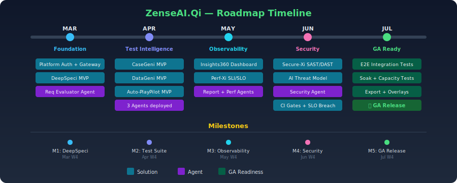
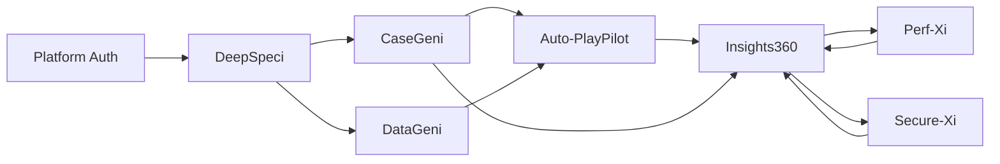

[← Architecture Hub](../../index.md)
{: .fs-3 }

<!-- Roadmap Timeline Diagram -->

# ZenseAI.Qi — Product Roadmap

---

## Roadmap Philosophy

Delivery follows a **monthly cadence** with weekly milestones. Each solution progresses from MVP → feature-complete → hardened. AI agents are delivered alongside their primary solution.

---

## Phase Overview

| Phase | Period | Theme | Key Deliverables |
|---|---|---|---|
| **Phase 1 — Foundation** | Mar W1 – Mar W4 | Core platform + DeepSpeci MVP | Auth, API gateway, DeepSpeci, Req Evaluator agent |
| **Phase 2 — Test Intelligence** | Apr W1 – Apr W4 | CaseGeni + DataGeni + Auto-PlayPilot | Test generation, synthetic data, Playwright automation |
| **Phase 3 — Observability** | May W1 – May W4 | Insights360 + Perf-Xi | Dashboards, SLI/SLO, k6 integration |
| **Phase 4 — Security & Hardening** | Jun W1 – Jun W4 | Secure-Xi + cross-cutting polish | SAST/DAST, threat modelling, NFR hardening |
| **Phase 5 — GA Readiness** | Jul W1 – Jul W4 | Integration, load testing, docs | End-to-end flows, capacity planning, GA release |

---

## Detailed Timeline

### March — Foundation

| Week | Solution | Feature | Agent | Status |
|---|---|---|---|---|
| W1 | Platform | Auth (OIDC), API gateway, RBAC | — | TODO |
| W1 | DeepSpeci | Upload & parse requirements | Req Evaluator | TODO |
| W2 | DeepSpeci | AI ambiguity detection | Req Evaluator | TODO |
| W3 | DeepSpeci | Rewrite suggestions + completeness scoring | Req Evaluator | TODO |
| W4 | DeepSpeci | Testability scoring + export | Req Evaluator | TODO |
| W4 | Platform | CI/CD pipeline + staging environment | — | TODO |

### April — Test Intelligence

| Week | Solution | Feature | Agent | Status |
|---|---|---|---|---|
| W1 | CaseGeni | Test case generation from requirements | Test Case Generator | TODO |
| W1 | Auto-PlayPilot | Basic Playwright script generation | Playwright MCP | TODO |
| W2 | CaseGeni | Gherkin output + coverage techniques | Test Case Generator | TODO |
| W2 | DataGeni | Schema inference + synthetic data gen | Test Data Generator | TODO |
| W3 | CaseGeni | Traceability matrix | Test Case Generator | TODO |
| W3 | DataGeni | PII-safe generation + FK integrity | Test Data Generator | TODO |
| W3 | Auto-PlayPilot | Page Object Model generation | Playwright MCP | TODO |
| W4 | DataGeni | Volume scaling (1 M rows) + export | Test Data Generator | TODO |

### May — Observability

| Week | Solution | Feature | Agent | Status |
|---|---|---|---|---|
| W1 | Insights360 | MVP dashboard (pass/fail/skip) | Report Agent | TODO |
| W1 | Perf-Xi | k6 script generation from OpenAPI | Performance Agent | TODO |
| W2 | Auto-PlayPilot | AI troubleshooting v1 | Playwright MCP | TODO |
| W2 | Secure-Xi | SAST integration (semgrep) | Security Agent | TODO |
| W3 | Insights360 | AI release narrative | Report Agent | TODO |
| W3 | Perf-Xi | SLI/SLO definition UI | Performance Agent | TODO |
| W4 | Insights360 | Trend analytics (7d, 30d) | Report Agent | TODO |

### June — Security & Hardening

| Week | Solution | Feature | Agent | Status |
|---|---|---|---|---|
| W1 | Secure-Xi | DAST integration (ZAP) | Security Agent | TODO |
| W1 | Insights360 | Trend analytics | Report Agent | TODO |
| W1 | Perf-Xi | Load profile orchestration | Performance Agent | TODO |
| W2 | Secure-Xi | AI threat model generation | Security Agent | TODO |
| W3 | Perf-Xi | SLO breach detection + CI gate | Performance Agent | TODO |
| W3 | Insights360 | Notification integration (Slack/Teams) | Report Agent | TODO |
| W4 | Secure-Xi | SCA scanning | Security Agent | TODO |
| W4 | Auto-PlayPilot | Visual regression | Playwright MCP | TODO |

### July — GA Readiness

| Week | Solution | Feature | Agent | Status |
|---|---|---|---|---|
| W1 | All | End-to-end integration testing | All agents | TODO |
| W1 | Insights360 | PDF/CSV export | Report Agent | TODO |
| W1 | Perf-Xi | AI regression analysis | Performance Agent | TODO |
| W1 | Secure-Xi | Security test case generation | Security Agent | TODO |
| W2 | All | Performance hardening + soak testing | Performance Agent | TODO |
| W3 | Insights360 | Perf-Xi + Secure-Xi overlays | Report Agent | TODO |
| W3 | Perf-Xi | AI capacity-planning report | Performance Agent | TODO |
| W3 | Secure-Xi | CI gate + Insights360 posture badge | Security Agent | TODO |
| W4 | All | GA release + documentation | — | TODO |

---

## Milestones

| Milestone | Date | Criteria |
|---|---|---|
| M1 — DeepSpeci MVP | Mar W4 | All FR-DS P0 requirements verified |
| M2 — Test Intelligence Suite | Apr W4 | CaseGeni + DataGeni + Auto-PlayPilot MVPs live |
| M3 — Observability Live | May W4 | Insights360 dashboard + Perf-Xi SLIs operational |
| M4 — Security Complete | Jun W4 | Secure-Xi SAST/DAST/SCA + threat model |
| M5 — GA Release | Jul W4 | All solutions integrated, SLOs met, docs published |

---

## Dependencies

---

## Risk Register (Roadmap-Level)

| Risk | Impact | Probability | Mitigation |
|---|---|---|---|
| LLM provider API instability | Agent failures | Medium | Multi-provider fallback |
| Scope creep in CaseGeni | April delay | Medium | Strict P0-only for MVP |
| Performance issues at scale | SLO breach | Medium | Early soak testing (May) |
| Security vulnerabilities in AI layer | Data exposure | Low | Guardrail pipeline from Day 1 |
