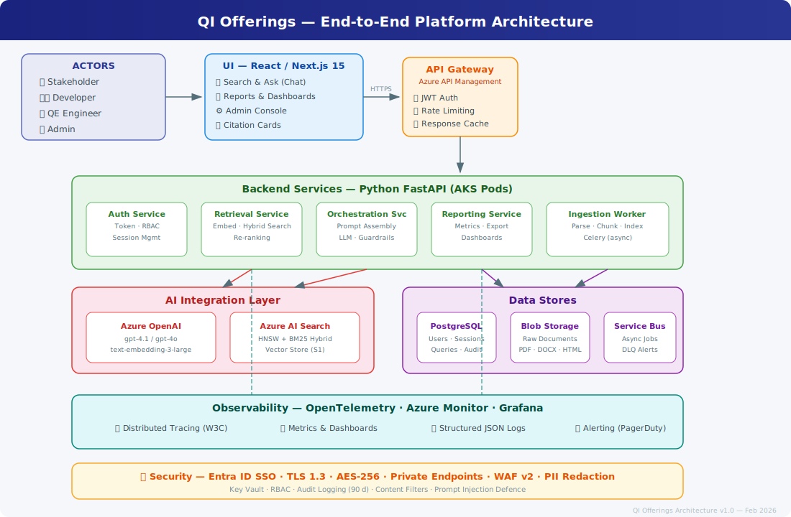

<!-- Hero Image -->


<!-- Platform Architecture Diagram -->


# QI Offerings – Architecture Hub

Welcome to the **QI Offerings** architecture documentation site. This hub provides comprehensive technical references for the end-to-end platform with LLM + RAG integration.

---

## 📚 Documentation Pages

| # | Document | Description |
|---|---|---|
| 📄 | [**Full Architecture (single page)**](architecture.md) | Complete E2E architecture in one document |
| 1 | [**Overview**](docs/01-overview.md) | Problem statement, success criteria, constraints, capability map |
| 2 | [**Architecture at a Glance**](docs/02-architecture-at-a-glance.md) | High-level context diagram (Mermaid) |
| 3 | [**AI Integration (LLM + RAG)**](docs/03-ai-integration.md) | LLM providers, embeddings, vector store, retrieval pipeline, guardrails |
| 4 | [**UI/UX**](docs/04-ui-ux.md) | React / Next.js stack, key screens, RAG UX patterns |
| 5 | [**Backend & APIs**](docs/05-backend-apis.md) | FastAPI services, API gateway, async processing, component diagram |
| 6 | [**Data & Storage**](docs/06-data-storage.md) | PostgreSQL, Azure AI Search, Blob Storage, ERD |
| 7 | [**Security & Compliance**](docs/07-security-compliance.md) | Entra ID, network controls, encryption, LLM safety |
| 8 | [**Observability & QE**](docs/08-observability-qe.md) | OpenTelemetry, metrics, test automation agent |
| 9 | [**Deployment & Environments**](docs/09-deployment.md) | AKS, CI/CD (GitHub Actions), Bicep IaC, blue/green |
| 10 | [**Non-Functional Requirements**](docs/10-nfr.md) | SLAs, latency targets, scalability, resilience |
| 11 | [**Appendix**](docs/11-appendix.md) | OpenAPI spec, prompt templates, config examples |

---

## Audience

| Persona | Start Here |
|---|---|
| **Stakeholders** | [Overview](docs/01-overview.md) → [NFR](docs/10-nfr.md) |
| **Developers** | [Backend](docs/05-backend-apis.md) → [AI Integration](docs/03-ai-integration.md) → [Appendix](docs/11-appendix.md) |
| **QE Engineers** | [Observability & QE](docs/08-observability-qe.md) → [Deployment](docs/09-deployment.md) |
| **Security Engineers** | [Security](docs/07-security-compliance.md) → [Data](docs/06-data-storage.md) |

---

## Tech Stack Overview

```
┌─────────────┐   ┌──────────────────┐   ┌────────────────────┐
│  React /    │   │  Azure API       │   │  FastAPI Services  │
│  Next.js 15 │──▶│  Management      │──▶│  (Python 3.12)     │
└─────────────┘   └──────────────────┘   └────────┬───────────┘
                                                   │
                    ┌──────────────────────────────┼──────────────┐
                    │                              │              │
              ┌─────▼──────┐  ┌────────────┐  ┌───▼──────┐  ┌───▼───────┐
              │ Azure AI   │  │ Azure      │  │ Postgres │  │ Azure     │
              │ Search     │  │ OpenAI     │  │ 16       │  │ Blob      │
              │ (Vectors)  │  │ (GPT-4.1)  │  │          │  │ Storage   │
              └────────────┘  └────────────┘  └──────────┘  └───────────┘
```

---

## 🚀 ZenseAI.Qi Platform

The **ZenseAI.Qi** platform builds on the QI Offerings architecture above, delivering 7 AI-powered solutions, 7 specialised agents, and an integrated QE workspace.

<!-- ZenseAI.Qi Platform Architecture -->


### Architecture & Roles

| Document | Description |
|---|---|
| [**Platform Architecture**](docs/architecture.md) | Mermaid architecture diagram + solution-agent-provider mapping |
| [**Roles & Personas**](docs/roles.md) | Stakeholders, skilled users, RACI matrix, human-in-the-loop |

### AI Agent Design Specs

| Agent | Primary Solution | Document |
|---|---|---|
| Requirement Evaluator | DeepSpeci | [Design Spec](docs/agents/requirement-evaluator.md) |
| Test Case Generator | CaseGeni | [Design Spec](docs/agents/test-case-generator.md) |
| Test Data Generator | DataGeni | [Design Spec](docs/agents/test-data-generator.md) |
| Playwright MCP | Auto-PlayPilot | [Design Spec](docs/agents/playwright-mcp.md) |
| Report Agent | Insights360 | [Design Spec](docs/agents/report-agent.md) |
| Performance Agent | Perf-Xi | [Design Spec](docs/agents/performance-agent.md) |
| Security Agent | Secure-Xi | [Design Spec](docs/agents/security-agent.md) |

### Solution Requirement Specs

| Solution | QE Work Lane | Document |
|---|---|---|
| DeepSpeci | Requirements interpretation & validation | [Requirements](docs/solutions/deepspeci.md) |
| CaseGeni | AI-assisted test automation workflows | [Requirements](docs/solutions/casegeni.md) |
| DataGeni | AI-assisted test automation workflows | [Requirements](docs/solutions/datageni.md) |
| Auto-PlayPilot | Create/optimise test libraries | [Requirements](docs/solutions/auto-playpilot.md) |
| Insights360 | Consolidated reporting & analytics | [Requirements](docs/solutions/insights360.md) |
| Perf-Xi | Performance test coordination & observability | [Requirements](docs/solutions/perf-xi.md) |
| Secure-Xi | Vulnerability scanning & threat analysis | [Requirements](docs/solutions/secure-xi.md) |

### Specifications

| Spec | Description | Document |
|---|---|---|
| Requirements Register | Consolidated FR/NFR across all solutions | [Register](specs/requirements/requirements-register.md) |
| Test Strategy | Test pyramid, traceability, coverage targets | [Strategy](specs/tests/test-strategy.md) |
| Security | Threat model, auth, data protection, guardrails | [Security](specs/security/security-spec.md) |
| Performance | SLIs/SLOs, budgets, capacity planning, runbooks | [Performance](specs/performance/performance-spec.md) |

### Roadmap

| Document | Description |
|---|---|
| [**Product Roadmap**](docs/roadmap/roadmap.md) | 5-phase delivery plan (Mar → Jul) with weekly milestones |

---

<p style="text-align:center; color:#888; font-size:0.85rem;">
QI Offerings · ZenseAI.Qi · Architecture Docs · 2026
</p>
